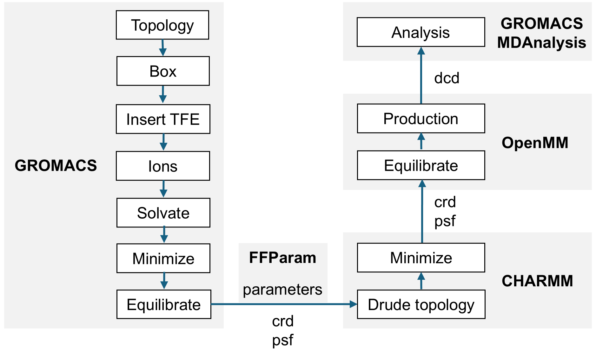

# drude-qm
MD and QM files for the drude paper

Paper: [Length of the methylene side chain in lysine modulates non-covalent interactions in histidine-rich peptides]()



## Files
- [drude_setup](https://github.com/mersalas/drude-qm/blob/main/drude_setup): instructions on how to setup Drude MD input files and run simulations
- [drude_ana](https://github.com/mersalas/drude-qm/blob/main/drude_ana): Gromacs scripts for MD analysis and ORCA scripts to run QM calculations
- [1_gromacs](https://github.com/mersalas/drude-qm/tree/main/1_gromacs):  
    - [coord](https://github.com/mersalas/drude-qm/tree/main/1_gromacs/coord): initial structures of lipopeptides in pdb format
    - [paramtr](https://github.com/mersalas/drude-qm/tree/main/1_gromacs/paramtr): mdp files
- [2_ffparam](https://github.com/mersalas/drude-qm/tree/main/2_ffparam): input & output files for Drude parameterization 
- [3_drude](https://github.com/mersalas/drude-qm/tree/main/3_drude): 
    - [coord](https://github.com/mersalas/drude-qm/tree/main/3_drude/coord): processed pdb & psf files
    - [scripts](https://github.com/mersalas/drude-qm/tree/main/3_drude/scripts): Drude MD scripts 
- [4_openmm](https://github.com/mersalas/drude-qm/tree/main/4_openmm): scripts to run Drude MD in OpenMM
- [5_ana](https://github.com/mersalas/drude-qm/tree/main/5_ana): inputs files & scripts to analyse trajectory files & calculate free energy surface
- [6_qm](https://github.com/mersalas/drude-qm/tree/main/6_qm): sample input files & script to perform QM calculations 

## How to cite:
```bibtex
@unpublished{Salas2025,
author = {Remmer L. Salas and Portia Mahal G. Sabido and Ricky B. Nellas},
title = {Length of the methylene side chain in lysine modulates non-covalent interactions in histidine-rich peptides},
journal = {},
volume = {},
pages = {},
year = {2026},
doi = {},
}